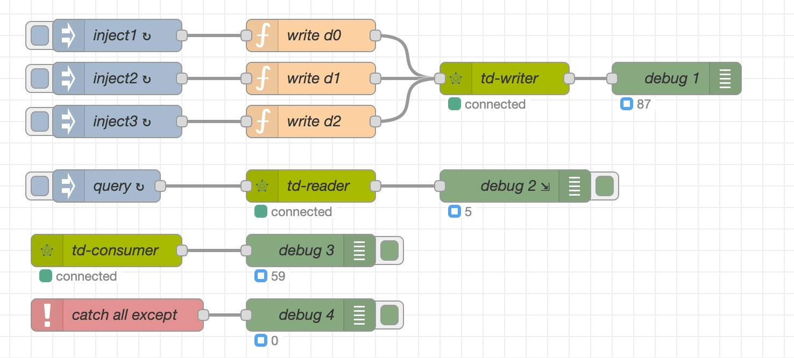

[Node-RED](https://nodered.org/) 是由 IBM 开发的基于 Node.js 的开源可视化编程工具，通过图形化界面组装连接各种节点，实现物联网设备、API 及在线服务的连接。同时支持多协议、跨平台，社区活跃，适用于智能家居、工业自动化等场景的事件驱动应用开发，其主要特点是低代码、可视化。

TDengine 与 Node-RED 深度融合为工业 IoT 场景提供全栈式解决方案。通过 Node-RED 的 MQTT/OPC UA/Modbus 等协议节点，实现 PLC、传感器等设备毫秒级数据采集。同时 Node-RED 中基于 TDengine 的毫秒级实时查询结果，触发继电器动作、阀门开合等物理控制，实现更实时的联动控制。

node-red-node-tdengine 是 TDengine 为 Node-RED 开发的官方插件，由两个节点组成：
- **tdengine-operator**：提供 SQL 语句执行能力，可实现数据写入/查询/元数据管理等功能。
- **tdengine-consumer**：提供数据订阅消费能力，可实现从指定订阅服务器消费指定 TOPIC 的功能。


## 前置条件

准备以下环境：

- TDengine 3.3.2.0 及以上版本集群已部署并正常运行（企业/社区/云服务版均可）。
- taosAdapter 能够正常运行，详细参考 [taosAdapter 参考手册](../../../reference/components/taosadapter)。
- Node-RED 3.0.0 及以上版本，[Node-RED 安装](https://nodered.org/docs/getting-started/)。
- Node.js 语言连接器 3.1.8 及以上版本，可从 [npmjs.com](https://www.npmjs.com/package/@tdengine/websocket) 下载。
- node-red-node-tdengine 插件 1.0.0 及以上版本，可从 [npmjs.com](https://www.npmjs.com/package/node-red-node-tdengine) 下载。

以上各安装组件调用关系如下图：


## 配置数据源
插件数据源在节点属性中配置，通过 [Node.js 语言连接器](../../../reference/connector/node/) 连接数据源，配置步骤如下：

1. 启动 Node-RED 服务，使用浏览器进入 Node-RED 主页。

2. 画布左侧在节点选择区域选择 tdengine-operator 或 tdengine-consumer 节点拖至画布。

3. 双击画布中选中节点，弹出属性设置窗口，填写数据库连接信息：
   - tdengine-operator 节点连接串格式：`ws://user:password@host:port`
   - tdengine-consumer 节点连接串格式：`ws://host:port`
  
    更多详细内容请点击画布右侧上方区域中字典图标按钮，参考在线帮助文档。
 
4. 配置完成后，点击右上角“部署”按钮，节点状态为绿色，表示数据源配置正确且连接正常。


## 使用示例

### 场景准备

#### 场景介绍

某生产车间有多台智能电表，电表每一秒产生一条数据，数据准备存储在 TDengine 数据库中，要求实时输出每分钟各智能电表平均电流、电压及用电量，同时要对电流 > 25A 或电压 > 230V 负载过大设备进行报警。

我们使用 Node-RED + TDengine 来实现需求：
- 使用 Inject + function 节点模拟设备产生数据。
- tdengine-operator 节点负责写入数据。
- 实时统计使用 tdengine-operator 节点查询功能。
- 过载报警使用 tdengine-consumer 订阅功能。

假设：
- TDengine 服务器：`www.example.com`。
- WEBSOCKET 端口：6041。
- 用户名/密码：默认。
- 模拟设备：三台（d0，d1，d2）。

#### 数据建模

使用数据库管理工具 taos-CLI，为采集数据进行手工建模，采用一张设备一张表建模思路：
- 创建超级表：meters。 
- 创建子表：d0，d1，d2。

建模 SQL 如下：
``` sql
create database test;
create stable test.meters (ts timestamp, current float, voltage int, phase float ) 
                     tags (groupid int, location varchar(24));
create table test.d0 using test.meters tags(1, 'workshop1');
create table test.d1 using test.meters tags(2, 'workshop1');
create table test.d2 using test.meters tags(2, 'workshop2');

```

### 业务处理

#### 数据采集
示例使用生成随机数方式模拟真实设备生产数据，tdengine-operator 节点配置 TDengine 数据源连接信息，并把数据写入 TDengine，同时使用 debug 节点监控写入成功数据量并展示于界面。

操作步骤如下：
- <b>增加写入节点</b> 
  1. 在节点选择区域选择 tdengine-operator 节点，拖动至画布中。
  2. 双击节点打开属性设置，名称填写 'td-writer'，数据库项右侧点击“+”号图标。
  3. 弹出窗口中，名称填写 'db-server'，连接类型选择使用字符串连接，输入：
   ``` sql
   ws://root:taosdata@www.example.com:6041 
   ```   
  4. 点击“添加”并返回。

- <b>模拟设备产生数据</b> 
  1. 在节点选择区域选择 function 节点，拖动至画布 td-writer 节点前。
  2. 双击节点打开属性设置，名称填写‘write d0’，下面选项卡选择“运行函数”，填写如下内容后保存并返回画布。
   ``` javascript
      // generate rand
      const value2 = Math.floor(Math.random() * (30 - 5 + 1)) + 5; // 5-30
      const value3 = Math.floor(Math.random() * (240 - 198 + 1)) + 198; // 198-240
      const value4 = Math.floor(Math.random() * (3 - 1 + 1)) + 1; // 1-3

      // sql
      msg.topic = `insert into test.d0 values (now, ${value2}, ${value3}, ${value4});`;

      return msg;
   ```
  3. 在节点选择区域选择 inject 节点，拖动至画布 write d0 节点前。
   
  4. 双击节点打开属性设置，名称填写‘inject1’，下拉列表中选择“周期性执行”，周期选择每隔 1 秒，保存并返回画布。
   
  5. 重复 1 ~ 4 步完成另外两台设备 (d1，d2) 流程。
   
- <b>增加信息输出</b> 
  1. 在节点选择区域选择 debug 节点，拖动至画布 td-writer 节点后。
  2. 双击节点打开属性设置，勾选“节点状态”，下拉列表中选择消息数量。


以上节点增加完成后，依次把上面节点按顺序连接起来，形成一条流水线，数据采集流程制作完成。

点击右上角“部署”按钮发布修改内容，运行成功后可以看到：
- td-writer 节点状态变成绿色，表示流程工作正常。
- debug 节点下的数字表示成功采集次数。


向下游节点输出写入成功结果，若失败抛出异常：
``` json
{
  "topic":  "insert into test.d1 values (now, 20, 203, 2);",
  "isQuery":  false,
  "payload":{
    "affectRows": 1,
    "totalTime":  2,
    "timing":     "961982"
  }
}
```

#### 数据查询
查询流程由三个节点（inject/tdengine-operator/debug）组成，完成每分钟实时输出各智能电表平均电流、电压及用电量需求。
由 inject 节点完成触发查询请求，结果输出至下游 debug 节点中，节点上显示查询执行成功数量。 

操作步骤如下：
  1. 将 inject 节点拖动至画布中，双击节点设置属性，名称填写 'query', msg.topic 填写并保存并返回画布：
   ``` sql
   select tbname, avg(current), avg(voltage), sum(p) 
   from ( select tbname,current,voltage,current*voltage/60 as p from test.meters 
          where  ts > now-60s partition by tbname)
   group by tbname;
   ``` 
  2. 将 tdengine-operator 节点拖动至画布中，双击节点设置属性，“数据库”选择前面已创建好的数据源 'db-server'，保存并返回画布。
  3. 将 debug 节点拖动至画布中，双击节点设置属性，勾选“节点状态”，下拉列表中选择“消息数量”，保存并返回画布。
  4. 依次把以上节点按顺序连接起来，点击“部署”按钮发布修改内容。

流程启动成功后：
- td-reader 节点状态变成“绿色”，表示流程工作正常。
- debug 节点显示查询成功次数。
  


向下游节点输出查询结果，若失败抛出异常：
``` json
{
  "topic":  "select tbname,avg(current) ...",
  "isQuery":  true,
  "payload": [
    {
      "tbname":      "d2",
      "avg(current)": 26.7,
      "avg(voltage)": 235,
      "sum(p)":       6329
    },
    {
      "tbname":       "d0",
      "avg(current)": 16.5,
      "avg(voltage)": 222,
      "sum(p)":       121
    },
    {
      "tbname":       "d1",
      "avg(current)": 29,
      "avg(voltage)": 202,
      "sum(p)":       5833
    }
  ]
}
```

#### 数据订阅
数据订阅流程由两个节点（tdengine-consumer/debug）组成，实现过载告警。  
debug 节点展示向下游节点推送数据次数，生产中可把 debug 节点更换为处理订阅数据的功能节点。

操作步骤如下：
  1. 使用 taos-CLI 手工创建订阅主题”topic_overload“,  SQL 如下：
   ``` sql
   create topic topic_overload as 
        select tbname,* from test.meters 
        where current > 25 or voltage > 230;
   ``` 
  2. tdengine-consumer 节点拖动至画布中，双击节点设置属性，填写如下内容后保存并返回画布。
     - 名称：td-consumer
     - 订阅服务器：`ws://www.example.com:6041`
     - 用户名：root
     - 密码：taosdata
     - 订阅主题：topic_overload
     - 消费开始位置：latest
     - 其它项保持默认
   
  3. 将 debug 节点拖动至画布中，双击节点设置属性，勾选“节点状态”，下拉列表中选择“消息数量”，保存并返回画布。
  4. 依次把以上节点按顺序连接起来，点击”部署“按钮发布修改内容。

流程启动成功后可看到 td-consumer 节点状态变成“绿色”表示流程工作正常，debug 节点数字表示消费次数，如下图：
  


向下游节点推送的过载设备警告信息，若失败抛出异常：
``` json
{
  "topic": "topic_overload",
  "payload": [
    {
      "tbname":   "d1",
      "ts":       "1750140456777",
      "current":  31,
      "voltage":  217,
      "phase":    2,
      "groupid":  4,
      "location": "California.MountainView"
    }
  ],
  "database":  "test",
  "vgroup_id": 4,
  "precision": 0
}
```

### 异常捕获
在数据采集、查询及订阅流程中，发生错误均按抛出异常机制来处理，需建立异常监控流程：
  1. 将 catch 节点拖动至画布中。
  2. 双击节点打开属性设置，名称填写 'catch all except'，捕获范围选择“所有节点”。
  3. 将 debug 节点拖动至画布 catch all except 节点后。
  4. 双击节点设置属性，勾选“节点状态”，下拉列表中选择“消息数量”，保存并返回画布。
  5. 依次把以上节点按顺序连接起来，点击”部署“按钮发布修改内容。    
流程启动后监控所有节点异常产生：
- debug 节点展示发生异常数量。
- 可通过 NODE-RED 日志系统查看异常详细。


### 运行效果
以上流程制作完成后，点击“部署”发布，进入运行状态，如下：


## 总结
本文通过工业监控场景展示了：

1. Node-RED 与 TDengine 的三种集成模式：
   - 数据采集（tdengine-operator 写入）
   - 实时查询（tdengine-operator 查询）
   - 事件驱动（tdengine-consumer 订阅）
2. 完整的错误处理机制
3. 生产环境部署参考方案

本文侧重从示例角度介绍，全部功能文档请在 Node-RED 节点在线文档中获取。
